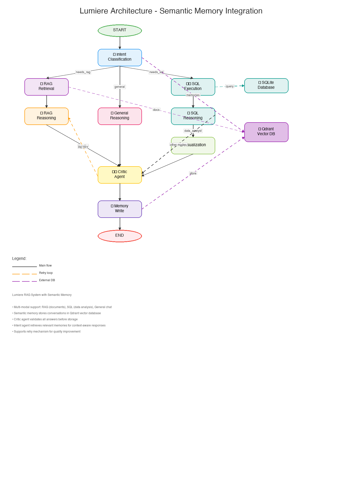

# 🌟 Lumiere — Agentic RAG Knowledge Workspace

> An intelligent multi-agent system combining RAG, SQL data analysis, and semantic memory for context-aware interactions

[](https://www.python.org/downloads/)
[](https://streamlit.io/)
[](https://qdrant.tech/)
[](https://www.langchain.com/)
[](LICENSE)



---

## 🎯 Project Vision

**Lumiere is an open-source, agentic RAG knowledge workspace that uses multi-agent reasoning, long- and short-term memory, and Qdrant-backed retrieval, with full observability via Langfuse.**

Lumiere transforms traditional Q&A systems into an **intelligent assistant that learns and adapts** through semantic memory, supporting multiple interaction modes:
- 📚 **RAG Mode**: Document-grounded responses with semantic search
- 📊 **Data Analyst Mode**: SQL queries with automated visualizations
- 💬 **General Chat**: Conversational AI with context awareness
- 🧠 **Semantic Memory**: Long-term learning from past interactions

---

## ✨ Key Features

### 🤖 Multi-Agent Architecture
- **Intent Agent**: Classifies queries and retrieves relevant memories
- **Reasoning Agent**: Generates grounded answers from retrieved context
- **SQL Agent**: Executes database queries and interprets results
- **Critic Agent**: Validates answer quality before storage
- **Visualization Agent**: Creates data visualizations (Data Analyst mode)

### 🧠 Semantic Memory System
- **Long-term memory** stored in Qdrant vector database
- **Automatic learning** from successful interactions
- **Context-aware responses** using past conversations
- **Quality filtering** via critic agent
- **Cross-session continuity** for personalized experiences

### 📊 Data Analysis & Visualization
- **Natural language to SQL** query generation
- **Automated chart creation** (bar, line, pie, scatter)
- **Interactive visualizations** with Plotly
- **Multi-table support** with SQLite backend

### 🔍 Advanced RAG
- **Hybrid chunking** with semantic overlap
- **Vector similarity search** using OpenAI embeddings
- **Metadata filtering** for precise retrieval
- **Source attribution** for transparency
- **Pronoun resolution** for conversational context

### 📈 Observability
- **Langfuse integration** for trace analysis
- **Token usage tracking** per operation
- **Performance metrics** for all agents
- **Debug logging** with emoji indicators
- **Memory statistics** dashboard

---

## 🏗️ Architecture

### System Overview

```
┌─────────────┐
│   User      │
│  (Streamlit)│
└──────┬──────┘
       │
       ▼
┌─────────────────────────────────────────┐
│         LangGraph Workflow              │
│  ┌──────────────────────────────────┐  │
│  │  Intent → Retrieve/SQL/General   │  │
│  │     ↓           ↓                 │  │
│  │  Reason  →   Critic  →  Memory   │  │
│  └──────────────────────────────────┘  │
└───────────┬─────────────┬───────────────┘
            │             │
    ┌───────▼─────┐   ┌──▼───────────┐
    │   Qdrant    │   │   SQLite     │
    │  (Vectors)  │   │  (Data)      │
    └─────────────┘   └──────────────┘
```

### Workflow Paths

1. **RAG Query Path**
   ```
   Intent (needs_rag) → Retrieve → Reason → Critic → Memory → END
   ```

2. **SQL/Data Analysis Path**
   ```
   Intent (needs_sql) → SQL Execute → SQL Reason → [Visualize] → Critic → Memory → END
   ```

3. **General Chat Path**
   ```
   Intent (general) → General Reason → Critic → Memory → END
   ```

See [GRAPH_ARCHITECTURE.md](docs/GRAPH_ARCHITECTURE.md) for detailed workflow documentation.

---

## 🚀 Quick Start

### Prerequisites

- Python 3.11+
- Qdrant (running locally or cloud)
- OpenAI API key
- Langfuse account (optional, for observability)

### Installation

1. **Clone the repository**
   ```bash
   git clone https://github.com/kikomatchi/lumiere.git
   cd lumiere
   ```

2. **Create virtual environment**
   ```bash
   python -m venv venv
   source venv/bin/activate  # On Windows: venv\Scripts\activate
   ```

3. **Install dependencies**
   ```bash
   pip install -r requirements.txt
   ```

4. **Set up environment variables**
   
   Create a `.env` file in the project root:
   ```env
   # OpenAI API
   OPENAI_API_KEY=your_openai_api_key_here
   
   # Qdrant Configuration
   QDRANT_URL=http://localhost:6333
   QDRANT_API_KEY=  # Optional, for Qdrant Cloud
   
   # Langfuse (Optional - for observability)
   LANGFUSE_PUBLIC_KEY=your_public_key
   LANGFUSE_SECRET_KEY=your_secret_key
   LANGFUSE_HOST=https://cloud.langfuse.com
   ```

5. **Start Qdrant** (if running locally)
   ```bash
   docker run -p 6333:6333 -p 6334:6334 \
       -v $(pwd)/qdrant_storage:/qdrant/storage:z \
       qdrant/qdrant
   ```

6. **Initialize Qdrant collections**
   ```bash
   python -c "from rag.collections import init_all_collections; init_all_collections()"
   ```

7. **Initialize semantic memory** (optional - seeds initial memories)
   ```bash
   python scripts/init_semantic_memory.py
   ```

8. **Run the application**
   ```bash
   streamlit run app.py
   ```

9. **Open your browser**
   
   Navigate to `http://localhost:8501`

---

## 📖 Usage Guide

### 1. Ingesting Documents

**Via Streamlit UI:**
1. Click "📄 Document Ingestion" in sidebar
2. Upload PDF, TXT, or MD files
3. Click "Ingest Documents"
4. Wait for confirmation

**Via Script:**
```bash
python -c "from rag.ingest import ingest_directory; ingest_directory('path/to/docs')"
```

### 2. Asking Questions

#### RAG Queries (Document-based)
```
"What is FFXIV?"
"Explain vector databases"
"How does semantic search work?"
```

#### Data Analysis Queries
```
"Show me the top 5 products by sales"
"How many hybrid cars are in the database?"
"What is the average price by manufacturer?"
```

#### General Chat
```
"Hello, how are you?"
"Can you help me with my project?"
"What can you do?"
```

### 3. Viewing Semantic Memory

**In Streamlit:**
1. Expand "🧠 Semantic Memory" in sidebar
2. View total memories and types
3. Search memories by keyword
4. See relevance scores and timestamps

**Via Python:**
```python
from memory.semantic_memory import get_memory_stats, retrieve_memories

# Get statistics
stats = get_memory_stats()
print(stats)

# Search memories
memories = retrieve_memories(
    query="database queries",
    top_k=5,
    user_id="user123",
    min_score=0.7
)
```

### 4. Switching Modes

Use the sidebar to select:
- **All In**: All features enabled (default)
- **Chat + RAG**: Document Q&A only
- **Data Analyst**: SQL queries + visualizations

---

## 🗂️ Project Structure

```
Lumiere/
├── agents/                    # Agent implementations
│   ├── intent_agent.py       # Intent classification + memory retrieval
│   ├── reasoning_agent.py    # RAG reasoning
│   ├── sql_agent.py          # SQL generation & execution
│   ├── critic_agent.py       # Quality validation
│   └── viz_agent.py          # Visualization generation
│
├── graph/                     # LangGraph workflow
│   ├── rag_graph.py          # Main graph definition
│   └── state.py              # State management
│
├── memory/                    # Semantic memory system
│   └── semantic_memory.py    # Vector-based memory storage/retrieval
│
├── rag/                       # RAG components
│   ├── chunking.py           # Document chunking strategies
│   ├── collections.py        # Qdrant collection management
│   ├── embeddings.py         # OpenAI embeddings wrapper
│   ├── ingest.py             # Document ingestion pipeline
│   ├── qdrant_client.py      # Qdrant client singleton
│   └── retriever.py          # Semantic search & filtering
│
├── database/                  # Data storage
│   └── sqlite_client.py      # SQLite connection & queries
│
├── config/                    # Configuration
│   └── settings.py           # Environment & settings
│
├── scripts/                   # Utility scripts
│   ├── init_semantic_memory.py   # Initialize memory system
│   ├── ingest_test.py            # Test document ingestion
│   └── retrieval_test.py         # Test retrieval
│
├── ui/                        # Streamlit components
│   └── (UI modules)
│
├── app.py                     # Main Streamlit application
├── requirements.txt           # Python dependencies
├── graph_visualization.mmd    # Mermaid diagram
├── graph_visualization.png    # Architecture diagram
├── GRAPH_ARCHITECTURE.md      # Detailed architecture docs
├── SEMANTIC_MEMORY.md         # Memory system documentation
└── README.md                  # This file
```

---

## 🧠 Semantic Memory System

### How It Works

1. **Storage**: Every accepted conversation is embedded and stored in Qdrant
   - Uses OpenAI `text-embedding-3-small` (1536 dimensions)
   - Includes query, response, mode, and metadata
   - Quality-filtered by critic agent (only ACCEPT decisions)

2. **Retrieval**: Intent agent retrieves relevant memories before processing
   - Top-k semantic search with cosine similarity
   - Configurable threshold (default: 0.75)
   - Formatted context injected into agent prompts

3. **Benefits**:
   - **Personalization**: Remembers user preferences
   - **Context**: Understands conversation history
   - **Learning**: Improves responses over time
   - **Continuity**: Works across sessions

### Memory Types

- `conversation`: General Q&A interactions
- `preference`: User preferences (e.g., "I prefer bar charts")
- `fact`: User-declared facts (e.g., "I'm working on X project")
- `pattern`: Common query patterns
- `error_resolution`: Problem-solving history

### Example

**First interaction:**
```
User: "Show me sales data as a bar chart"
Assistant: [Generates bar chart]
💾 Stores: User prefers bar charts for sales data
```

**Later interaction:**
```
User: "Show me revenue trends"
Assistant: [Retrieves memory about chart preference]
           [Automatically generates bar chart]
```

See [SEMANTIC_MEMORY.md](docs/SEMANTIC_MEMORY.md) for detailed documentation.

---

## 📊 Data Analyst Mode

### Features

- **Natural language to SQL**: Generate queries from plain English
- **Automated visualizations**: Smart chart type selection
- **Interactive charts**: Plotly-based visualizations
- **Result interpretation**: Natural language summaries

### Supported Chart Types

- **Bar Chart**: Comparisons, rankings
- **Line Chart**: Trends over time
- **Pie Chart**: Proportions, distributions
- **Scatter Plot**: Correlations, relationships

### Example Queries

```
"Show me sales by region"
→ SQL: SELECT region, SUM(sales) FROM sales GROUP BY region
→ Chart: Bar chart with regions on x-axis

"How have prices changed over time?"
→ SQL: SELECT date, AVG(price) FROM products GROUP BY date
→ Chart: Line chart showing price trends

"What's the distribution of car types?"
→ SQL: SELECT type, COUNT(*) FROM cars GROUP BY type
→ Chart: Pie chart showing proportions
```

---

## 🔍 Advanced RAG Features

### Chunking Strategies

- **Semantic chunking**: Split by meaning, not just length
- **Overlap**: Maintains context between chunks
- **Metadata preservation**: Source, page numbers, timestamps

### Retrieval Options

- **Hybrid search**: Combines semantic + keyword search
- **Metadata filtering**: Filter by source, date, type
- **Reranking**: Re-scores results for relevance
- **Source attribution**: Shows where answers come from

### Document Support

- **PDF**: Automatic text extraction
- **TXT**: Plain text files
- **Markdown**: Preserves formatting
- **Batch ingestion**: Process entire directories

---

## 🎛️ Configuration

### Key Settings (config/settings.py)

```python
# Model Configuration
OPENAI_MODEL = "gpt-4o-mini"
EMBEDDING_MODEL = "text-embedding-3-small"
EMBEDDING_DIMENSIONS = 1536

# Retrieval Settings
TOP_K_RETRIEVAL = 3
MIN_SIMILARITY_SCORE = 0.7

# Memory Settings
MEMORY_TOP_K = 3
MEMORY_MIN_SCORE = 0.75

# Chunking
CHUNK_SIZE = 1000
CHUNK_OVERLAP = 200
```

### Environment Variables

See `.env.example` for all available configuration options.

---

## 🐛 Troubleshooting

### Common Issues

**1. Qdrant Connection Error**
```
Error: Cannot connect to Qdrant
```
**Solution**: Ensure Qdrant is running on `localhost:6333`
```bash
docker ps | grep qdrant  # Check if running
```

**2. OpenAI API Error**
```
Error: Invalid API key
```
**Solution**: Check `.env` file has correct `OPENAI_API_KEY`

**3. No Memories Stored**
```
Memory count remains at 3
```
**Solution**: 
- Check critic is accepting answers (look for ✅ in terminal)
- Ensure Qdrant collection exists
- Verify semantic memory is enabled

**4. Import Errors**
```
ModuleNotFoundError: No module named 'X'
```
**Solution**: Reinstall dependencies
```bash
pip install -r requirements.txt
```

### Debug Mode

Enable detailed logging:
```python
# In config/settings.py
DEBUG_MODE = True
```

Look for these debug indicators in terminal:
- 💾 Memory Write Node
- ✅ Stored semantic memory
- ⏭️ Skipping memory storage
- 📦 Retrieval node
- 🔍 Query analysis

---

## 📈 Observability

### Langfuse Integration

Lumiere integrates with Langfuse for comprehensive observability:

1. **Traces**: Full request lifecycle tracking
2. **Token usage**: Cost monitoring per operation
3. **Latency**: Performance metrics
4. **Agent behavior**: Decision tracking

**Setup:**
1. Create account at [langfuse.com](https://langfuse.com)
2. Add keys to `.env`
3. View traces in Langfuse dashboard

### Memory Statistics

View memory stats in terminal:
```bash
python -c "from memory.semantic_memory import get_memory_stats; import json; print(json.dumps(get_memory_stats(), indent=2))"
```

Example output:
```json
{
  "total_memories": 15,
  "vector_size": 1536,
  "memory_types": {
    "conversation": 10,
    "preference": 3,
    "fact": 1,
    "pattern": 1
  }
}
```

---

## 🤝 Contributing

We welcome contributions! Please see our contributing guidelines.

### Development Setup

1. Fork the repository
2. Create a feature branch
3. Make your changes
4. Add tests if applicable
5. Submit a pull request

### Code Style

- Follow PEP 8
- Use type hints
- Add docstrings to functions
- Keep functions focused and small

---

## 📝 Documentation

Full documentation is available in the [`docs/`](docs/) folder:

- **[Quick Start Guide](docs/QUICKSTART.md)**: Get up and running in 5 minutes
- **[Architecture Guide](docs/GRAPH_ARCHITECTURE.md)**: Detailed workflow documentation
- **[Semantic Memory Guide](docs/SEMANTIC_MEMORY.md)**: Memory system documentation
- **[Contributing Guide](docs/CONTRIBUTING.md)**: How to contribute
- **[Changelog](docs/CHANGELOG.md)**: Version history and updates
- **[Documentation Index](docs/DOCUMENTATION.md)**: Complete documentation overview

## 🧪 Testing

Comprehensive test suite with 34 tests covering core functionality:

```bash
# Run all tests
pytest

# Run with coverage
pytest --cov=. --cov-report=html

# Run specific test file
pytest tests/test_semantic_memory.py
```

**Test Coverage:**
- ✅ Semantic Memory (9 tests)
- ✅ Intent Agent (6 tests)
- ✅ Graph Workflow (10 tests)
- ✅ RAG Components (10 tests)

See [`tests/README.md`](tests/README.md) for complete testing guide and [`TEST_SETUP_SUMMARY.md`](TEST_SETUP_SUMMARY.md) for current status.

---

## 🗺️ Roadmap

### Current Features ✅
- Multi-agent RAG system
- Semantic memory integration
- SQL data analysis
- Automated visualizations
- Critic-based quality control
- Langfuse observability

### Coming Soon 🚧
- [ ] Multi-user support with user isolation
- [ ] Memory pruning and consolidation
- [ ] Advanced query routing
- [ ] Custom embedding models
- [ ] API endpoints (REST/GraphQL)
- [ ] Memory analytics dashboard
- [ ] Feedback loop for memory refinement

### Future Vision 🔮
- [ ] Multi-modal support (images, audio)
- [ ] Agent collaboration framework
- [ ] Distributed memory architecture
- [ ] Real-time streaming responses
- [ ] Plugin system for extensibility

---

## 📄 License

This project is licensed under the MIT License - see the [LICENSE](LICENSE) file for details.

---

## 🙏 Acknowledgments

Built with:
- [LangChain](https://www.langchain.com/) - LLM framework
- [LangGraph](https://langchain-ai.github.io/langgraph/) - Agent orchestration
- [Qdrant](https://qdrant.tech/) - Vector database
- [Streamlit](https://streamlit.io/) - UI framework
- [OpenAI](https://openai.com/) - LLM & embeddings
- [Langfuse](https://langfuse.com/) - Observability

---

## 📧 Contact

For questions, issues, or feedback:
- Open an issue on GitHub
- Check existing documentation
- Review troubleshooting section

---

## ⭐ Star History

If you find Lumiere useful, please consider giving it a star! ⭐

---

**Made with ❤️ for the AI community**